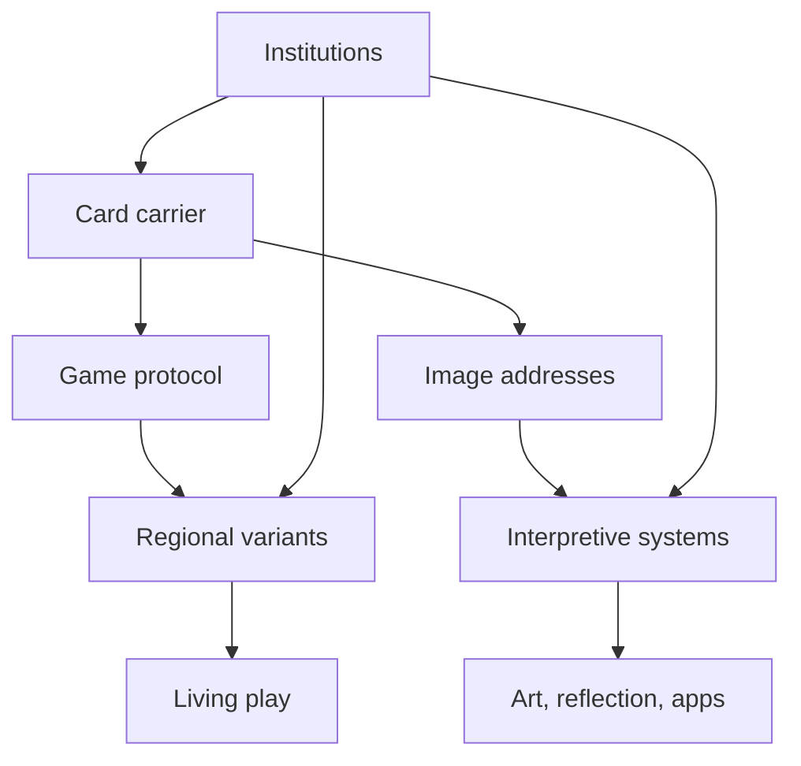

# Architectural extraction — Tarot as a versioned interpretive protocol

This is a National Treasure extraction, not a historical claim that Tarot “really was” software architecture. The analogy is labeled `STRUCTURAL_ISOMORPHISM` and remains inside the case.

## Task-world cut

### Included

- the Tarot evidence assembled in this case;
- the repository Method;
- the Palimpsest Stack relation grammar and shape language;
- the Front Room rule that current owner evidence outranks cached framing;
- the user’s request for a reusable, very deep continuity model.

### Omitted

- unrelated National Treasure cases;
- supernatural adjudication;
- automatic promotion into canonical architecture;
- any claim that a symbolic similarity proves historical descent.

## Free Graph

This graph refuses a single trunk after the carrier. The game and interpretive branches coexist, while institutions influence what is manufactured, preserved, taught, and displayed.

## The layer model

| Layer | Tarot instance | Stable contract | Failure if collapsed |
|---|---|---|---|
| Carrier | physical or digital deck | finite addressable set; shuffle/order operations | treating medium as meaning |
| Schema | pack size, suits, trump membership/order, titles | enough shared addresses for recognition | calling every oracle deck Tarot or excluding valid regional packs |
| Rules | trick-taking, scoring, Fool behavior, dealing | locally documented executable procedure | assuming symbolic books define game behavior |
| Image surface | composition, costume, gesture, color | quoteable visual relations | treating iconographic resemblance as ancestry |
| Exegesis | meanings, correspondences, spreads, guidebooks | internally stated interpretive mapping | silently merging incompatible schools |
| Query lens | question, spread position, neighboring cards, reader tradition | context controls which relations become salient | pretending a card has one context-free payload |
| Institution | workshop, guild, order, publisher, federation, museum, app | authority and distribution channels | mistaking prestige for proof |
| Provenance | object, catalog, account, edition, rule set, study | claim-source trace | losing the difference between survival and representativeness |

## The core structural result

Tarot behaves like a **versioned interpretive protocol over a persistent but mutable carrier**.

- A deck defines addresses.
- A tradition supplies a schema and allowable transformations.
- A spread or game position supplies a typed lens.
- Neighboring cards or played tricks supply relational context.
- A reader or player executes a local protocol.
- A publication, order, federation, museum, or platform supplies institutional authority.
- Provenance gates claims about ancestry and consequence.

This does not make every interpretation equivalent. It makes evaluation local and typed. A historically false Egyptian genealogy can still have high documented influence after 1781. A psychologically useful reading can be meaningful without becoming a causal forecast. A close visual parallel can be worth exploring without becoming ancestry.

## Relation gate

Before a relation crosses from resemblance into genealogy, require an attributable road:

1. **source and target are bounded**—which objects, editions, workshops, or systems?
2. **time order is possible**—could the source have reached the target?
3. **contact is evidenced**—ownership, exhibition, correspondence, translation, teaching lineage, publication access, or workshop copying;
4. **the copied feature is discriminating**—not merely a widespread archetype or generic geometry;
5. **alternatives are tested**—shared precursor, coincidence, retrospective naming, and institutional projection;
6. **confidence remains separate from relation type**.

Without those gates, keep `FORMAL_RESEMBLANCE`, `CONTEXTUAL_ASSOCIATION`, or `UNKNOWN`.

## Query lens

A card-reading interpretation can be represented as:

`interpretation = f(card edition, card address, orientation, spread position, neighbors, question, reader tradition, social context)`

The function is not offered as a scientific law. It prevents a recurring category error: treating a guidebook gloss as the permanent content of the cardboard. It also explains why the same card can remain recognizable across Marseille, Waite–Smith, Thoth, and contemporary decks while producing incompatible readings.

## LSD return

### DISSOLVE

Break “Tarot” into carrier, game, image, exegesis, institution, and provenance. The ancient-secret story loses its false unity.

### ROTATE

Move from “What do the symbols secretly mean?” to “What did workshops manufacture, what did players do, and what could later authors actually access?” The overlooked game line becomes central.

### COLLIDE

Place three claims side by side: a museum’s object record, the same museum’s weak Roma-transmission essay, and specialist history. Authority is shown to be claim-local rather than institution-wide.

### INVERT

Instead of asking how one secret survived, ask what repeatedly changed while the deck remained identifiable. Continuity becomes a relation among partial invariants.

### FOLLOW

Track renamings and re-encodings: *trionfi* → *tarocchi* → Tarot; Papess → Juno or High Priestess; unnumbered Fool → zero; game pack → divinatory deck → app interface.

### BREAK

Remove Egyptian, Roma, Templar, and Kabbalistic ancestry from the origin layer. The documented history still works. That is a destructive test: the core continuity does not depend on those myths.

### RETURN

The simplest surviving model is a braid with a stable-enough address space, copied carrier, locally executable protocols, and versioned interpretive overlays.

## Candidate classification

| Candidate | Classification | Why | Promotion |
|---|---|---|---|
| Tarot is a versioned interpretive protocol layered over a game/object substrate. | **STRUCTURAL** | explains documented persistence and forkability | none |
| A spread is a typed query lens: card + position + neighbors + question + tradition. | **GENERATIVE** | useful for building interfaces and analysis tools | none |
| The strongest uninterrupted line is game/manufacture, not occult doctrine. | **STRUCTURAL** | survives chronological and object-level checks | none |
| Every symbolic system is equally true because meanings vary. | **HALLUCINATORY** | variation does not erase evidence or local constraints | refused |
| Tarot secretly encodes the Palimpsest Stack. | **POETIC** | resonant but no historical road | refused as ancestry |
| A future interface could expose relation type and confidence beside each interpretation. | **GENERATIVE** | turns provenance discipline into user-visible affordance | none |

`PROMOTION: NONE`

## Buildable child

A bounded future child could be a **Tarot relation explorer**:

- choose a card address or historical claim;
- view objects and texts by date;
- toggle game, iconographic, occult, artistic, and institutional layers;
- display each edge type and confidence;
- show failed and refused ancestries rather than deleting them;
- allow a reading lens without presenting projection as source authority.

The evidence workbook in this case is the smallest current prototype: sortable chronology, claims, sources, and phase intervals. It is not a divination engine.

