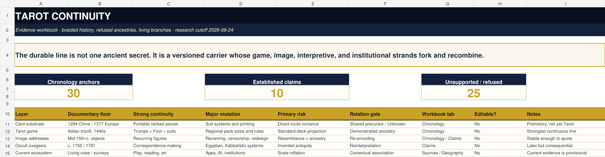

# Tarot continuity: the deck that kept changing without ceasing to be itself

Status: evidence-backed case dossier  
Research cutoff: 2026-08-24  
Scope: card-substrate prehistory; fifteenth-century Italian invention; game transmission; image families; cartomancy and occult reinterpretation; mass publishing; contemporary artistic, reflective, digital, and institutional uses

## Short answer

Tarot is not the fossil of one ancient Egyptian, Hebrew, Roma, Templar, Cathar, or prehistoric doctrine. The securely documented thing called Tarot begins in fifteenth-century northern and central Italy as a family of trick-taking card games: an ordinary four-suit pack receives a permanent trump sequence and a special Fool. Courts commissioned luxury examples, but the game escaped the court, moved through workshops and trade routes, and diversified.

What survives is therefore not one unchanged message. It is a **braided continuity**:

1. a material carrier—portable cards made, copied, sold, collected, and now digitized;
2. a game protocol—four suits, ranked trumps, the Fool, and local rules;
3. an image repertoire—recognizable figures repeatedly redrawn, renamed, censored, restored, or replaced;
4. an interpretive protocol—first scattered cartomancy, then late-eighteenth- and nineteenth-century occult systems, then psychological, artistic, political, and reflective uses;
5. institutions—courts, cardmakers, guilds, publishers, occult orders, museums, clubs, federations, artists, readers, and online platforms;
6. surviving objects and documents—the uneven evidence that lets us distinguish history from a persuasive resemblance.

The strongest uninterrupted line is the **game-and-manufacture line**, not a secret doctrine. The occult Tarot is real and historically consequential, but it is a later fork built on the older pack. Its lateness does not make it fake. It makes it an attributable reinterpretation.

## Reading key

This case uses the repository method and the relation grammar in `cases/palimpsest-stack/`.

- **Observed**: a catalogued object, text, rule set, or record can be inspected.
- **Primary**: a period object or document directly bears the claim.
- **Inference**: the claim connects evidence but goes beyond its literal contents.
- **Speculation**: a live possibility with insufficient proof.
- **Failed**: a search, attribution, or test did not support the proposed claim.

Confidence is stated separately: **Established**, **Probable**, **Possible**, or **Unsupported**. “Looks like” is never silently promoted to “descends from.” Full claim states and sources live in [CLAIM-LEDGER.md](CLAIM-LEDGER.md) and [SOURCES.md](SOURCES.md).

## The continuity model

| Strand | Earliest secure state in this dossier | What persists | What changes | Continuity verdict |
|---|---|---|---|---|
| Card substrate | Chinese paper cards documented by 1294; Mamluk-suited fragments before European Tarot; European cards documented in 1377 | portable, repeatable, shuffled, ranked pieces | suit systems, court figures, printing, markets | remote prehistory and probable shared card ecology; exact east-to-west route remains incomplete |
| Tarot game | Italian *trionfi* records in the 1440s; surviving painted packs from the mid-fifteenth century | extra permanent trumps, Fool, four suits, trick-taking family | pack size, trump order, scoring, suits, local rules | strongest demonstrated Tarot continuity |
| Iconography | mid-fifteenth-century Italian triumph images | a recurring address space of figures such as Fool, Emperor, Wheel, Death, Star, World | titles, order, gender, costume, religious sensitivity, scenic detail | continuity by repeated copying and re-encoding, not fixed meaning |
| Divination | documented eighteenth-century practices; printed occult program from 1781 onward | cards as randomized prompts and ordered symbolic arrays | meanings, spreads, correspondences, claimed antiquity | later documented fork, not the pack’s original purpose |
| Esoteric systems | Court de Gébelin, Etteilla, Lévi, Wirth, Papus, Golden Dawn, Waite, Crowley | mapping Tarot to larger symbolic systems | incompatible Hebrew-letter, astrological, elemental, numerical, and initiatory schemes | multiple reinterpretations, not one recovered code |
| Mass and personal media | industrial printing and the 1909 Waite–Smith deck | reproducible deck plus guidebook; individual reading | art styles, identities, politics, therapy-adjacent reflection, fandom, apps, AI | explosive pluralization rather than doctrinal convergence |
| Institutions | courts and workshops, then clubs, publishers, federations, museums, universities, online communities | authorization, distribution, preservation | who gets to define “Tarot” | continuity is partly institutional and contested |

## Act I — before Tarot: the card world that made it possible

### China: a real card history, not a completed Tarot genealogy

Chinese sources matter because they show that paper cards and card-like games existed before Europe’s first secure playing-card records. Andrew Lo’s source criticism is especially important: the much-repeated Tang-dynasty “game of leaves” is not secure evidence for playing cards. A 1294 legal record is a firmer point for printed cards in China.

That establishes **chronological priority for an East Asian card substrate**. It does not establish a documentable chain from a particular Chinese pack to Mamluk cards, European suit cards, or Tarot. The correct edge is `UNKNOWN` or, at most, a possible remote precursor—not `DEMONSTRATED_ANCESTRY`.

### The Mamluk comparison: close enough to matter, incomplete enough to resist romance

Islamic cards provide a closer formal comparison to early European suit systems. A fragmentary Egyptian deck now at LACMA uses four suits—cups, coins, swords, and polo sticks—with numbered cards and nonfigural court ranks. The suit correspondences are striking, while polo sticks have no direct place in a European culture unfamiliar with polo and may have been re-encoded as staves or batons.

This supports a probable transmission environment between Islamic and European cards. It does not, by itself, document the exact workshop, merchant, port, date, or copy chain that produced European packs. The Mamluk material is part of Tarot’s **card prehistory**, not evidence that Mamluks used Tarot’s twenty-two-trump structure.

### Europe by 1377

European references to playing cards become secure in 1377. The rapid spread recorded over the next decades implies that cards arrived slightly earlier, but the documentary floor matters. These were ordinary suit cards, not yet Tarot. They establish the receiving substrate to which Italian makers later added a trump sequence.

**Verdict:** Tarot has ancestors at the level of the card medium and suit pack. Its distinct game architecture is a later Italian innovation.

## Act II — invention without a single birthday, c. 1410–1450

### A family of experiments

The beginning is a cluster, not a certificate.

- A description associated with Martiano da Tortona, usually dated around the 1420s, presents a commissioned card game with sixteen classical gods and four bird suits. It is a strong structural precursor to permanent illustrated trumps, but it is not yet the later standard Tarot pack.
- A Florentine record copied in a later manuscript reports that Giusto Giusti supplied Sigismondo Malatesta with *naibi a trionfi* in 1440. Because the evidence survives through a seventeenth-century copy rather than the autograph journal, the entry is important but its transmission must remain visible.
- Ferrarese court accounts in the early 1440s refer to *carte da trionfi*.
- Surviving Visconti, Visconti–Sforza, and Brambilla cards from the mid-fifteenth century demonstrate that richly painted suit and trump cards existed in Milanese court culture.
- Other evidence points toward Florence and Bologna as active early centers. A Milan-only origin is therefore too narrow.

No surviving record names one inventor, one first workshop, or one canonical first pack. “Created in Renaissance Italy, probably in the 1410s–1430s, securely visible by the 1440s” is stronger than a falsely exact birthday.

### What the innovation did

Early Tarot took a four-suit pack and added a sequence of image cards that outranked the suits in trick-taking. The Italian name *trionfi*—triumphs—described those cards and their function. A Fool occupied a special, locally variable role. The familiar later total of seventy-eight cards—fifty-six suit cards, twenty-one ranked trumps, and the Fool—stabilized by the end of the fifteenth century, but early surviving packs and lists show variation in membership, order, labels, and numbering.

This matters because later readers often treat the twenty-two “Major Arcana” as a pristine philosophical book. The first evidence instead shows a developing game system. The images could carry moral, civic, dynastic, religious, festive, and satirical resonances without constituting one secret syllabus.

### Luxury survival and survival bias

The earliest objects that survived are disproportionately elite, hand-painted commissions. That does not prove the game remained an aristocratic secret. Durable, prized objects survive more readily than cheap, heavily played cards. Printed and ordinary packs likely did much of the work of diffusion while leaving a thinner object record.

**Verdict:** Tarot emerges as a distributed design process within northern and central Italian court-and-workshop networks. A named single author remains unknown.

## Act III — stabilization, print, and regional mutation, c. 1450–1750

### The pack becomes reproducible

Print expanded Tarot beyond singular court objects. The circa-1491 Sola Busca is the earliest complete seventy-eight-card pack known to survive. Its trumps use unusual ancient-warrior figures, and its suit cards contain full scenes rather than isolated suit signs. It proves that scenic treatment of the pip cards predates the twentieth century, even though such treatment was not the dominant early standard.

The word history also changes. *Trionfi* is the early name. Forms of *tarocchi* or *taraux* appear by 1505, and the etymology remains uncertain. “Tarot” is the French descendant; it is not an ancient Egyptian word recovered from hieroglyphs.

### The “Marseille” family is a later consolidation

As Tarot moved into France and Switzerland, makers regularized a recognizable woodblock image family now called the Tarot de Marseille. Jean Noblet’s mid-seventeenth-century Paris pack is among the earliest substantially preserved examples of that pattern. But “Tarot de Marseille” is a retrospective nineteenth-century label, conventionally traced to Romain Merlin in 1856. It names a family after the fact; it does not identify the birthplace of Tarot.

The family itself is neither perfectly uniform nor unchanged. Cardmakers copied blocks, corrected or introduced details, translated titles, changed colors, and adapted images to local religious and political pressure. Besançon-pattern packs, for example, substituted Juno and Jupiter for the Papess and Pope. That is `REENCODING`: continuity through alteration.

### Expansion packs and local games

Tarot did not march toward one inevitable standard.

- Florentine Minchiate expanded the trump series and produced a ninety-seven-card pack.
- Bologna developed its own ordering and a shortened sixty-two-card form still associated with Ottocento.
- Piedmontese, Sicilian, Swiss, Austrian, Hungarian, Slovenian, and other traditions changed suits, ranks, pack sizes, and rules.
- From the eighteenth and nineteenth centuries, French-suited Tarot packs increasingly used hearts, diamonds, clubs, and spades, often replacing allegorical trumps with genre scenes. The Bourgeois Tarot or *Tarot Nouveau* family is a conspicuous result.

These are not failed copies of a spiritual original. They are the living evolutionary tree of the game.

### Suppression was local, not a single Church campaign

Cards were repeatedly caught in gambling restrictions, sumptuary rules, sermons, and moral panics. Savonarola’s Florentine bonfire of 1497 included gaming objects. Yet the evidence does not support a continuous, universal ecclesiastical campaign to eradicate an encoded heresy. Tarot also circulated in Catholic regions for centuries. The more precise history is jurisdictional, intermittent, and entangled with gambling, luxury, and public order.

**Verdict:** between 1450 and 1750, Tarot’s continuity is visibly industrial and regional: printing, workshop copying, rule variation, and repeated local re-encoding.

## Act IV — cards learn to answer questions, c. 1750–1900

### Cartomancy did not begin with the Egypt story

Divinatory uses of ordinary playing cards precede the full occult Tarot program. A mid-eighteenth-century Bolognese sheet associates Tarot cards with divinatory meanings, showing that such use was possible before the famous Parisian theories. Jean-Baptiste Alliette, writing as Etteilla, published a method for reading ordinary cards in 1770 and later produced Tarot manuals and a purpose-built occult deck.

This is a functional fork: the same shuffled carrier and ordered images become a prompt system rather than—or alongside—a trick-taking game.

### 1781: an invented antiquity with enormous consequences

In volume VIII of *Le Monde primitif* (1781), Antoine Court de Gébelin argued that Tarot preserved Egyptian wisdom. His argument was conjectural and appeared before the decipherment of Egyptian hieroglyphs. It is not evidence that fifteenth-century Italian cardmakers possessed an Egyptian “Book of Thoth.”

Yet the claim was generative. Etteilla elaborated it, designed a divinatory pack, and helped transform Tarot into an occult technology. The Egypt story is therefore historically false as fifteenth-century ancestry but historically real as an eighteenth-century **reinterpretation that changed later practice**.

### The nineteenth-century correspondence engine

Éliphas Lévi linked Tarot’s twenty-two trumps with the twenty-two letters of the Hebrew alphabet and embedded the deck in a larger ceremonial and Kabbalistic synthesis. Oswald Wirth, Papus, and occult orders such as the Hermetic Order of the Golden Dawn produced further mappings to astrology, elements, paths, numbers, and initiatory grades.

The systems disagree. Even the assignment of particular Hebrew letters or astrological correspondences can shift between schools. Incompatibility is evidence against a single recovered original code and evidence for a powerful **correspondence-making tradition**.

The now-familiar division into “Major Arcana” and “Minor Arcana” belongs to this later occult vocabulary, not the documented language of the fifteenth-century game.

### Roma origin: refuse the stereotype, preserve the chronology

European writers repeatedly attributed occult arts and Tarot transmission to Roma people. The claim is unsupported: no attributable chain connects Roma communities to Tarot’s invention or its decisive spread. The reason is not a simplistic chronology—Roma communities were present in parts of Italy in the early fifteenth century—but the absence of evidence for the asserted transmission role.

This distinction matters. A weak debunk simply replaces one stereotype with bad chronology. A responsible one rejects an imposed origin story without treating Roma people as props in somebody else’s occult genealogy.

**Verdict:** divination and occult Tarot are documented historical continuities from the eighteenth century onward. Their claims of ancient origin are not.

## Act V — the illustrated grammar goes global, 1909–1970

### Pamela Colman Smith was a co-creator, not decorative labor

Arthur Edward Waite supplied the esoteric program and Pamela Colman Smith designed the images for the deck first published in 1909 by Rider. Its decisive innovation was not the first-ever appearance of illustrated suit cards—the Sola Busca disproves that superlative—but the creation of a coherent, mass-published scenic suit sequence whose situations could sustain narrative reading.

Waite’s own *Pictorial Key to the Tarot* rejected Court de Gébelin’s Egyptian history while preserving an esoteric and initiatory framework. Smith’s composition, theatrical experience, color, gesture, and visual storytelling made that framework legible card by card. The deck’s later marketing as “Rider–Waite” obscured her authorship; “Waite–Smith” or “Rider–Waite–Smith” restores it.

The Waite–Smith sequence became a new address space. Thousands of later decks quote it even when their art, politics, theology, or identities differ radically.

### Crowley–Harris: a related but incompatible synthesis

Aleister Crowley and Lady Frieda Harris developed the Thoth paintings from the late 1930s into the early 1940s. Crowley’s *Book of Thoth* appeared in 1944; the full color deck circulated later. It shares Golden Dawn ancestry with Waite’s system but revises names, imagery, ordering, and correspondences. It is a sibling fork, not a commentary layer that can be silently collapsed into Waite–Smith.

### Art, Surrealism, and psychology

Artists treated cards as combinatorial machines. The 1940–41 Surrealist *Jeu de Marseille* was an oracle-like collaborative deck rather than a standard Tarot pack. Later artists including Salvador Dalí made Tarot a vehicle for self-mythology and art history. Italo Calvino used card sequences as a narrative constraint in *The Castle of Crossed Destinies*.

Carl Jung briefly discussed Tarot in a 1933 seminar, but the large modern category called “Jungian Tarot” is mainly a later interpretive development. Sallie Nichols’s 1980 work is a key bridge. The useful distinction is between `DOCUMENTED_INFLUENCE` and retrospective labeling: modern archetypal readings can be fruitful without proving that medieval makers encoded Jungian psychology.

**Verdict:** twentieth-century Tarot becomes a reproducible visual language with several dominant dialects. Authorship, publishing, and art history become as important as occult orders.

## Act VI — plural revival, 1970–2020

Cheap color printing, counterculture, feminist spirituality, New Age retail, independent publishing, and later print-on-demand production multiplied decks and users. Motherpeace, developed in the late 1970s, made the round card and feminist reframing part of the medium’s grammar. Queer, diasporic, ecological, anti-racist, disability-centered, pop-cultural, and secular-reflective decks followed.

This pluralization has two opposed possibilities:

- **repair and recognition**: people excluded from older European imagery can author themselves into the deck;
- **extraction and flattening**: publishers can detach living traditions from their communities, combine incompatible symbols, or use “ancient” as a marketing solvent.

The historical method does not decide whether a contemporary spiritual claim is meaningful. It does require that a new meaning be labeled as a new meaning rather than retrofitted into fifteenth-century evidence.

Tarot also split further by function: fortune-telling, ritual, meditation, journaling, creative writing, therapy-adjacent reflection, collecting, art practice, and competitive or social play. These functions overlap but do not authorize one another. A psychologically suggestive reading is not automatically a causal prediction, and a statistically random draw is not evidence of supernatural mechanism.

## Act VII — museums, apps, algorithms, and living games, 2020–2026

### The game never disappeared

The Fédération Française de Tarot maintains contemporary rules for a seventy-eight-card game played by three, four, or five players. Documented regional games continue in France, Italy, Austria, Hungary, Slovenia, Switzerland, Romania, and elsewhere. In other words, the “before it became divination” game is not merely before. It is present.

That living line is often obscured in English-language popular culture, where “Tarot” commonly means divination. The semantic split is geographical and institutional: game clubs and federations preserve one continuity, publishers and readers another.

### Public revival and institutional reframing

The Warburg Institute’s 2025 exhibition *Tarot: Origins & Afterlives* explicitly staged the transition from Renaissance game to divination, art, and activism. The Morgan Library & Museum’s 2026 exhibition and catalog organized six centuries of material around recurring motifs. These exhibitions do not merely display an unchanged tradition; they actively construct the public history through selection, captioning, comparison, and omission.

Museums are high-value sources for objects, but not infallible narrators. A 2022 Metropolitan Museum essay repeated a claim that Roma travelers transformed Tarot into fortune-telling. The claim conflicts with specialist historical consensus and lacks attributable evidence. Institutional prestige cannot upgrade a weak lineage.

### Current use and scale

A Pew Research Center survey conducted in October 2024 found that 11% of U.S. adults said they consulted Tarot cards at least annually; only 1% said they relied on Tarot “a lot” for major life decisions. The distinction between occasional consultation and high-stakes reliance is crucial. “Many people use Tarot” does not imply one belief, one effect, or one level of dependence.

Apps and generative systems now simulate shuffling, spreads, guidebooks, and conversational interpretation. A 2026 preprint describes interview-based research on AI-assisted Tarot as a noncausal, reflective practice. That is useful evidence for an emerging interface pattern, not proof of efficacy or a settled account of the field.

**Verdict:** contemporary Tarot is a media ecosystem. The pack is physical and digital, playable and readable, sacred and secular, collective and personalized. Its pluralism is the continuity.

## Object trail: what can actually be pointed to

| Approx. date | Object or record | What it establishes | What it does not establish |
|---:|---|---|---|
| 1294 | Chinese legal record concerning printed cards | secure pre-European paper-card evidence | a direct Chinese-to-Tarot chain |
| 13th–14th c. | Mamluk suit-card fragments | an Islamic four-suit card culture with close formal parallels | Tarot trumps or a documented workshop-to-workshop route |
| 1377 | European written references to playing cards | secure ordinary-card presence in Europe | Tarot already exists |
| c. 1420s | Martiano da Tortona description | a probable courtly experiment with permanent illustrated powers | the standard twenty-two-card trump series |
| 1440 | copied Giusto Giusti journal entry | *naibi a trionfi* reported in Florentine context | an autograph surviving record or single birthplace |
| 1442 | Ferrarese accounts | court purchase/production of *trionfi* cards | sole Ferrarese invention |
| c. 1450–1480 | Visconti-family cards | surviving suit-and-trump material from Milanese court culture | a complete, fixed, universally ordered deck |
| c. 1491 | Sola Busca | earliest complete surviving 78-card deck; fully scenic suit cards | the standard iconography of later Marseille packs |
| 1505 | *tarocchi/taraux* attestations | shift from *trionfi* toward later name family | known etymology |
| mid-17th c. | Jean Noblet pack | early preserved Marseille-pattern family | an original fifteenth-century “Tarot de Marseille” brand |
| c. 1750 | Bolognese divinatory meanings sheet | Tarot used for divinatory association before Court de Gébelin | ancient divinatory purpose |
| 1770 | Etteilla’s ordinary-card manual | printed cartomantic method | Tarot-specific ancient doctrine |
| 1781 | Court de Gébelin, *Le Monde primitif* VIII | public Egyptian reinterpretation | evidence of Egyptian ancestry |
| c. 1789 | Etteilla’s occult pack | early purpose-designed divinatory Tarot | restoration of a pharaonic original |
| 1854–56 | Lévi’s *Dogme et rituel* | influential Tarot–Kabbalah synthesis | medieval Hebrew-letter encoding |
| 1889 | Wirth and Papus publications | systematic fin-de-siècle occult Tarot | one agreed esoteric correspondence scheme |
| 1909 | Waite–Smith deck | mass-published scenic visual grammar | first ever illustrated pip cards |
| 1938–43 / 1944 | Harris paintings / Crowley text | Thoth synthesis and a major sibling lineage | identity with Waite’s system |
| 1970s onward | feminist and independent decks | conscious redesign of bodies, roles, shape, and politics | automatic freedom from appropriation |
| 2025–26 | Warburg and Morgan exhibitions | institutional recognition of a six-century plural history | a final, closed canon |

## Seven image addresses and how they mutate

The images do not carry one recoverable dictionary. They behave more like stable addresses to which generations attach changing programs.

| Address | Early visual/social field | Major re-encodings | Continuity lesson |
|---|---|---|---|
| Fool | marginal traveler, entertainer, social outsider; special game card | zero-numbering, spiritual seeker, sacred fool | role and image persist while rank and valuation shift |
| Bagatto / Magician | street performer, artisan, mountebank, table of tools | occult will, elemental operator, creative agency | title change can redirect the same composition |
| Papess / High Priestess | provocative female ecclesiastical figure within medieval/early-modern imagination | Juno in some regional packs; Waite’s veiled initiatrix | censorship and sacralization are different re-encodings |
| Hanged Man | inverted body associated with disgrace, punishment, or traitor imagery | voluntary suspension, sacrifice, changed perspective | later interior meaning should not erase civic-punitive context |
| Death / XIII | skeletal mortality and social leveling; often captionless in Marseille-family packs | transformation, ending, regeneration | euphemism and psychology accumulate around a stark image |
| Lightning / Tower / House of God | falling structure, fire or celestial strike; titles vary | catastrophe, revelation, ego collapse | resemblance to Babel is contextual, not demonstrated source |
| World | encompassing figure, civic/cosmic totality, completion | anima, integration, global wholeness | broad compositional continuity supports many incompatible readings |

## The myth ledger in one page

| Claim | State | Typed relation | Why |
|---|---|---|---|
| Tarot is an Egyptian Book of Thoth | **Unsupported as ancestry; established as 1781 reinterpretation** | `REFUSED_ANCESTRY` + `REINTERPRETATION` | no pre-1781 Egyptian chain; Court’s conjecture changed later Tarot |
| Roma people invented or carried Tarot into Europe | **Unsupported** | `REFUSED_ANCESTRY` | no attributable transmission evidence; stereotype repeatedly projected onto Roma communities |
| Tarot was originally Kabbalistic | **Unsupported as origin; established as occult synthesis** | `REINTERPRETATION` | mappings appear centuries after the Italian game and vary between systems |
| Templars, Cathars, Grail custodians, or heretics encoded the trumps | **Unsupported** | `CLAIMED_ANCESTRY` / `REFUSED_ANCESTRY` | resemblance and narrative fit without a documentable road |
| Petrarch’s *Trionfi* directly supplied the trump sequence | **Possible context, unproved source** | `CONTEXTUAL_ASSOCIATION` | shared triumph culture and vocabulary do not prove direct design dependence |
| The “Mantegna Tarocchi” is a Tarot deck | **Contradicted** | `RETROSPECTIVE_NAMING` + `CONTRADICTION` | it is a fifty-print didactic series, not a playable Tarot pack |
| Charles VI commissioned the surviving “Charles VI Tarot” from Gringonneur in 1392 | **Contradicted attribution** | `RETROSPECTIVE_NAMING` + `CONTRADICTION` | payment concerns painted cards; surviving cards are mid-fifteenth-century Italian |
| The 22 trumps and their order were fixed from day one | **Contradicted** | `CONTRADICTION` | early packs and lists vary; surviving cards are incomplete and often unnumbered |
| Tarot de Marseille is the original Tarot | **Contradicted** | `RETROSPECTIVE_NAMING` | it is a later French pattern family with a nineteenth-century label |
| Pamela Colman Smith merely illustrated Waite’s already-complete system | **Misleading** | `DOCUMENTED_INFLUENCE` plus co-authorship | her scenic narrative design materially created the deck’s later grammar |
| All religious authorities continuously banned Tarot | **Overgeneralized** | `CONTRADICTION` | local gambling bans and moral campaigns existed; no single continuous universal suppression |
| Jung created or secretly decoded Tarot | **Unsupported** | `RETROSPECTIVE_NAMING` | brief documented interest became a much larger later “Jungian Tarot” tradition |

## What the whole history says

1. **Identity can persist without essence.** A deck remains recognizably Tarot when enough relations survive across carrier, rules, image addresses, names, and institutions. No one strand is sufficient in every period.
2. **Later invention is still continuity.** Etteilla, Lévi, Smith, Harris, feminist deckmakers, museum curators, and app designers did not merely recover or corrupt a static original. They made consequential new versions.
3. **Resemblance has low evidentiary weight.** An Egyptian-looking motif, twenty-two letters, a journey archetype, or a familiar cosmology can motivate interpretation. Without an attributable route, it cannot establish ancestry.
4. **The game line prevents a false before/after.** Tarot did not stop being a game when it became a divinatory medium. The branches coexist.
5. **The archive is biased.** Luxury decks, famous male occultists, mass publishers, and museum collections are overrepresented. Ordinary players, workshop labor, women’s authorship, ephemeral packs, and community practice are harder to see.
6. **“First” claims are hazardous.** First surviving, first documented, first printed, first complete, first mass-market, first fully scenic, and first designed specifically for divination are different claims.
7. **The best deep history keeps its fog.** Exact invention, the east-to-west card route, several early trump orders, workshop dependencies, and many modern influence claims remain unresolved.

## National Treasure extraction

For the reusable architecture—typed layers, relation gates, query lens, and promotion limits—see [ARCHITECTURAL-EXTRACTION.md](ARCHITECTURAL-EXTRACTION.md). For the adversarial attack, see [MADDCL0WN.md](MADDCL0WN.md). The evidence workbook, `tarot-continuity-ledger.xlsx`, exposes the chronology, claims, sources, and phase-tempo calculations in sortable form.

## Research boundary

This dossier reconstructs historical continuity; it does not adjudicate supernatural truth, provide divination, or make clinical claims. It treats practitioners’ accounts as evidence of practice and meaning, not automatic evidence of causal prediction. The current-use section is intentionally provisional because the digital field is changing quickly.

## Further lanes deliberately left open

This v0.1 is good enough to carry forward, not finished enough to pretend closure. The next high-value passes are:

1. reconstruct the earliest Italian city/workshop dependency graph from account books and surviving sheets;
2. deepen the Islamic-to-European card route without converting probable transmission into a fictional straight line;
3. build a card-by-card image genealogy across Visconti, Marseille, Sola Busca, Waite–Smith, and Thoth;
4. map the living game families with rules, pack sizes, names, and current player institutions;
5. audit censorship and suppression jurisdiction by jurisdiction rather than as one Church story;
6. recover workshop labor, women’s authorship, cheap packs, and ordinary players hidden by luxury-object survival;
7. trace exactly which Sola Busca materials Pamela Colman Smith could have encountered;
8. compare occult correspondence systems without silently harmonizing them;
9. study contemporary community decks edition by edition, including repair, appropriation, and accountable lineage;
10. revisit app and AI-mediated Tarot after better longitudinal, privacy, reliance, and harm evidence exists.
